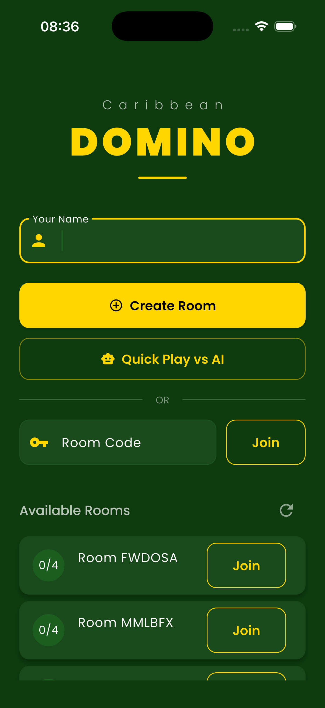

# Caribbean Domino Game - Real-time Multiplayer

A real-time multiplayer Caribbean-style domino game built with React Native/Expo and backed by Supabase + Vercel serverless API. Features 4-player team matches (2v2), AI bot opponents, room-based matchmaking, and custom SVG-rendered domino tiles with animations.

## Screenshots

<p align="center">
  
  
  
</p>

| Lobby | Room Setup | Gameplay |
|:---:|:---:|:---:|
| Create or join rooms, quick play vs AI | Enter name, browse available rooms | Board, opponent hands, turn indicator, score tracking |

## Tech Stack

- **React Native / Expo** - Cross-platform mobile framework (iOS/Android)
- **Zustand** - Lightweight state management
- **Supabase Realtime** - Real-time game state synchronization via PostgreSQL change streams
- **Vercel API** - Serverless Node.js backend for game logic
- **TypeScript** - Type-safe interfaces replacing Freezed models
- **Expo Router** - File-based routing
- **React Native SVG** - Custom domino tile rendering with pip layouts
- **React Native Reanimated** - Tile placement, flip, and score animations
- **Expo Haptics** - Haptic feedback for game events

## Features

- 4-player team-based domino (2 teams of 2)
- Room-based matchmaking with shareable room codes
- Quick Play vs AI with bot opponents (Alpha, Beta, Gamma)
- Real-time game state sync across all connected clients
- Custom SVG-rendered domino tiles with standard pip layouts (0-6)
- Interactive board with scroll support
- Tile placement animations with spring physics
- Haptic feedback for tile placement, pass, and win events
- Score tracking with animated counters and progress bars
- Turn indicators with pulsing glow effects
- Dark green felt-table themed UI

## Setup

1. Configure your API URLs in `src/core/constants/apiConfig.ts`:
   - Set `vercelApiUrl` to your deployed Vercel domino server
   - Set `supabaseUrl` and `supabaseAnonKey` to your Supabase project credentials

2. Install dependencies:
   ```bash
   npm install
   ```

3. Run the app:
   ```bash
   npx expo start
   ```

   Then press `i` for iOS simulator, `a` for Android emulator, or scan the QR code with Expo Go.

## Architecture

```
src/
  core/           - Constants, theme, services (haptics)
  data/           - TypeScript models and repositories (API, Realtime)
  domain/         - Business logic services
  presentation/   - UI components (game board, tiles, shared widgets)
  store/          - Zustand state management
app/
  _layout.tsx     - Root layout with GestureHandler and StatusBar
  index.tsx       - Lobby screen (create/join rooms, quick play)
  game/[roomId]   - Game screen (board, hands, turn logic)
  results/[roomId]- Results screen (scores, winner display)
```

## Game Rules

- 28 tiles (double-six set)
- 4 players, 7 tiles each
- Teams: players across from each other (seats 0+2, seats 1+3)
- First to empty their hand scores the round
- Blocked game: team with lowest remaining pip count scores
- First team to 100 points wins

## Conversion Notes

This project was converted from a Flutter implementation. Key mapping:
- **Riverpod** -> **Zustand** store
- **GoRouter** -> **Expo Router** (file-based routing in `app/`)
- **Freezed models** -> **TypeScript interfaces** with helper functions
- **CustomPainter** -> **React Native SVG** components
- **flutter_animate** -> **React Native Reanimated** animations
- **Supabase Flutter** -> **@supabase/supabase-js**
- **Vibration plugin** -> **Expo Haptics**
